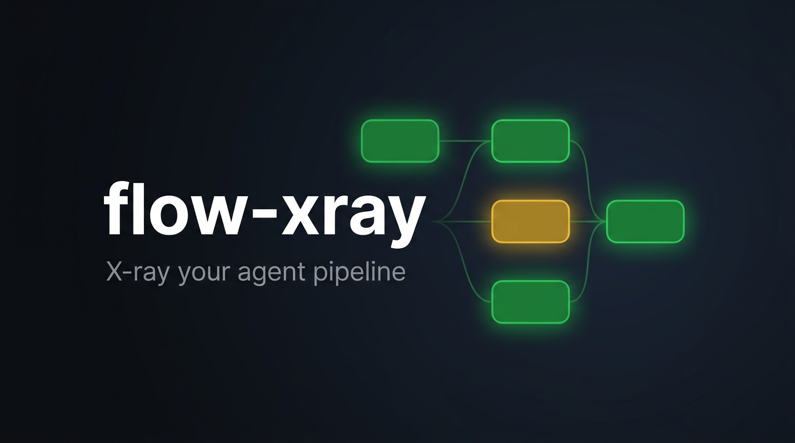
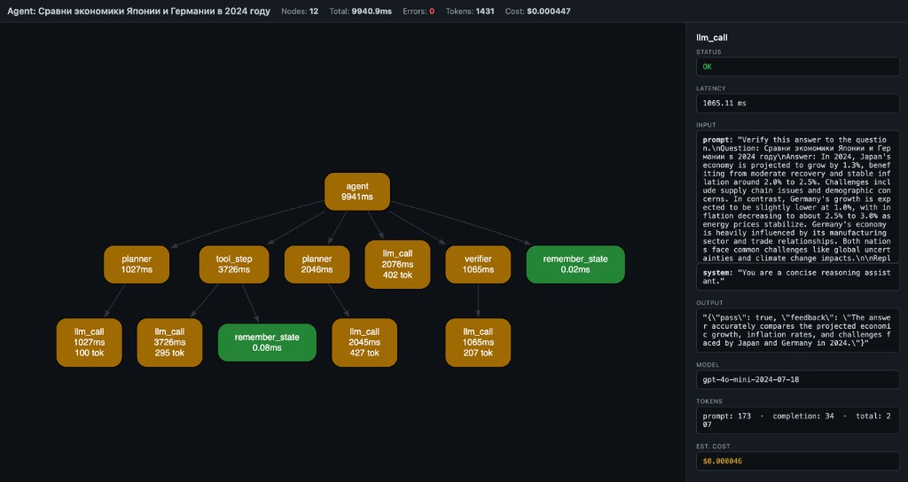

<p align="center">
  
</p>

<p align="center">
  <b>See what your agent actually does.</b><br>
  One decorator, one HTML file — a visual execution graph instead of logs.
</p>

<p align="center">
  <a href="https://pypi.org/project/flow-xray/"></a>
  <a href="https://github.com/kroq86/flow-xray/blob/main/LICENSE"></a>
  
</p>

---

```python
from flow_xray import trace

@trace
def call_llm(prompt):
    return openai.chat(prompt)

@trace
def agent(query):
    plan = call_llm(f"plan: {query}")
    return call_llm(f"answer based on: {plan}")

result = trace.run(agent, "weather in Tokyo?")
result.to_html("trace.html")
```

<p align="center">
  
</p>

Open `trace.html` — you get a **DAG** of every traced step with inputs, outputs, latency, tokens, cost, and errors. Click a node to inspect. No server, no account, no log viewer — one local file.

## Install

```bash
pip install flow-xray
```

## Usage

### Decorator + `trace.run`

```python
from flow_xray import trace

@trace
def step_a(x):
    return x + 1

@trace
def pipeline(x):
    return step_a(x) * 2

result = trace.run(pipeline, 5)
result.to_html("pipeline.html")
```

### CLI

```bash
flow-xray run my_agent.py --html trace.html
```

The script must use `@trace` on the functions you want captured. The CLI provides the session; just call your functions normally.

### Token / cost tracking

Token usage and estimated cost are auto-extracted from OpenAI response objects, or you can set them manually:

```python
@trace
def call_llm(prompt):
    resp = openai.chat.completions.create(...)
    trace.meta(model=resp.model,
               prompt_tokens=resp.usage.prompt_tokens,
               completion_tokens=resp.usage.completion_tokens)
    return resp.choices[0].message.content
```

### What you see

- **Nodes** = function calls (name + latency + tokens)
- **Edges** = caller → callee
- **Green** = OK, **Red** = error, **Yellow** = slow (>1s)
- **Header** = total nodes, latency, tokens, estimated cost
- **Click a node** → side panel shows inputs, output, error, timing, model, tokens, cost

## Why this exists

Langfuse, Helicone, LangSmith — they give you **timelines and logs**.

But when your agent pipeline branches, retries, or chains 6 tools — you don't need another table. You need a **graph**.

flow-xray is **not** an agent framework. It's the layer **below** them — like Chrome DevTools is to browsers.

## How it works

`@trace` wraps functions. When called inside a `trace.run()` session (or `flow-xray run` CLI), it records:
- function name
- bound arguments
- return value or exception
- wall-clock latency
- token usage and estimated cost (auto or manual)
- parent/child relationships (call stack → DAG)

`result.to_html()` embeds the trace as JSON in a self-contained HTML page that renders via WASM Graphviz (CDN, works offline after first load).

## Also included

Scalar autodiff core (micrograd-style `Value` graph with DOT/JSON export and stepping debugger) lives under `flow-xray dot` CLI and `from flow_xray import Value`. See `examples/` and `plan.md`.

## License

MIT
